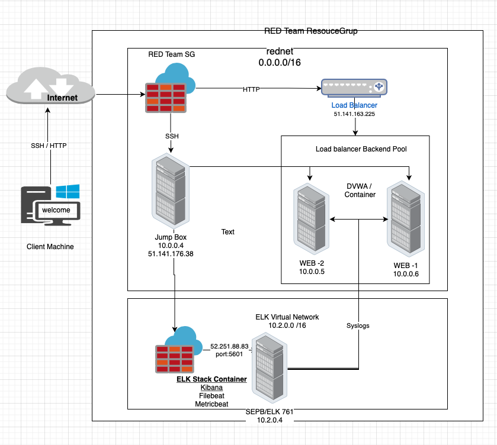
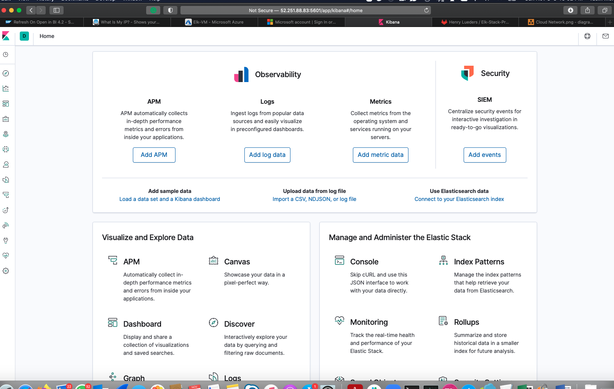
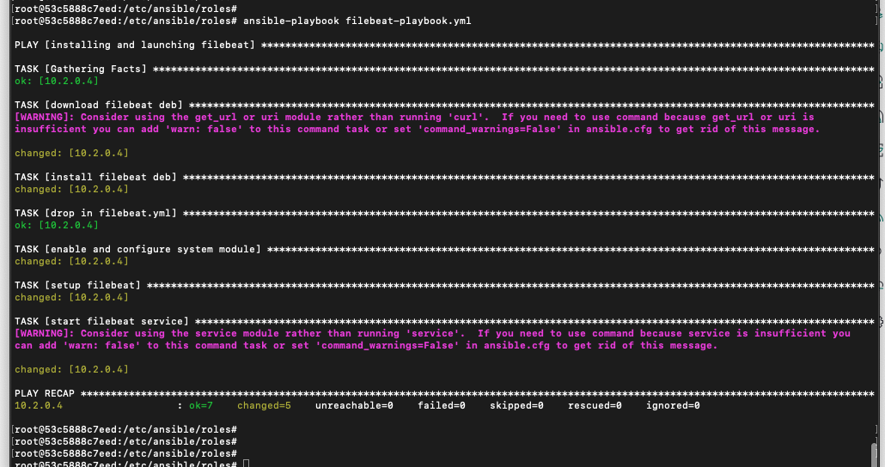
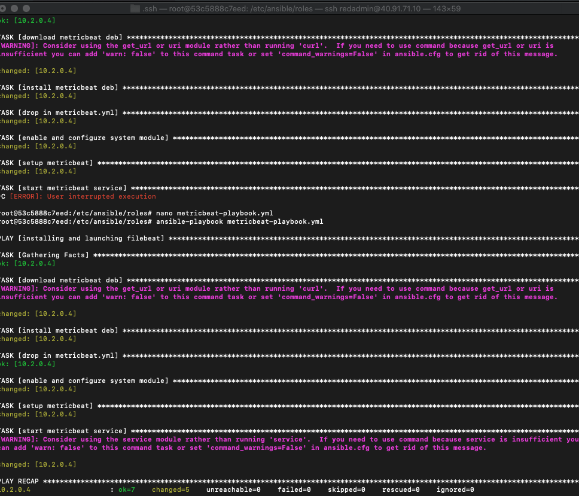
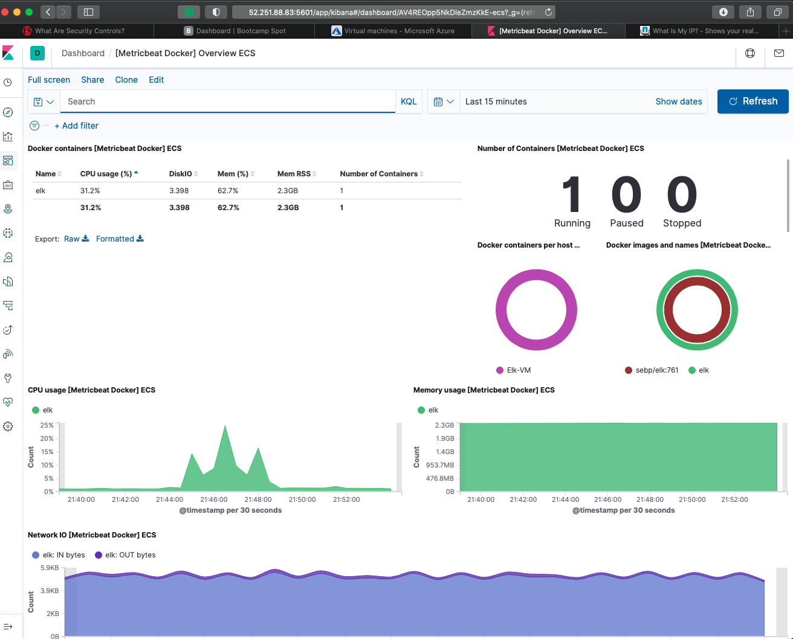

## Automated ELK Stack Deployment

The files in this repository were used to configure the network depicted below.

These files have been tested and used to generate a live ELK deployment on Azure. They can be used to either recreate the entire deployment pictured above. Alternatively, select portions of the Playbook YAML file may be used to install only certain pieces of it, such as Filebeat.

  - The following playbooks are used to create the ELK-Server in the Azure box
   - Ansible playbook
   - Filebeat playbook

This document contains the following details:
- Description of the Topology
- Access Policies
- ELK Configuration
  - Beats in Use
  - Machines Being Monitored
- How to Use the Ansible Build

### Description of the Topology

The main purpose of this network is to expose a load-balanced and monitored instance of DVWA, the D*mn Vulnerable Web Application.

Load balancing ensures that the application will be highly available to the user, in addition to restricting direct access to the network.
- What aspect of security do load balancers protect? 
        - Load balancing ensures the distributin of network / web traffic across multiple servers
        - Load balancing ensures the availabilty of applications to the users
        - Load balancing ensures no single server gets too much traffic
        - Load balancing protects the network from DDOS attack
        
- What is the advantage of a jump box?
  - Jumpbox acts as Secure Admin WorkStation
  - Jump box prevents all VM / Container’s expose to the public
  - Jump box enables monitoring and logging from a single box.
  - Jumb box enables adminstrators to perform admin tasks on containers
  
Integrating an ELK server allows users to easily monitor the vulnerable VMs for changes to the system logs and system services and traffic.
- What does Filebeat watch for?
    - system log files 
    - locations
    - events logs
    - forwards them to Elasticsearch or Logstash
    
- What does Metricbeat record?
  - Operating system metrics
  - Server (Services) metrics
  

The configuration details of each machine may be found below.

| Name          	| Function       	| IP Address 	| Operating System 	|
|---------------	|----------------	|------------	|------------------	|
| Jump Box      	| Jump Box       	| 10.0.0.4   	| Ubuntu Linux     	|
| Load Balancer 	| Load Balancer  	| Private IP 	|                  	|
| Web-1         	| DVWA Container 	| 10.0.0.5   	| Ubuntu Linux     	|
| Web-2         	| DVWA Container 	| 10.0.0.6   	| Ubuntu Linux     	|
| Elk-Server    	| ELK            	| 10.2.0.4   	| Ubuntu Linux     	|

### Access Policies

The machines on the internal network are not exposed to the public Internet. 

Only the Jump Box Provisioner machine can accept connections from the Internet. Access to this machine is only allowed from the following IP addresses:
- 198.115.xx.xx ( Personal IP)

Machines within the network can only be accessed by SSH.
- Which machine did you allow to access your ELK VM? What was its IP address?
  - Personal IP address
  - Jump box Provisoner

A summary of the access policies in place can be found in the table below.

| Name       	| Publicly Accessable 	| Allowed IP              	|
|------------	|---------------------	|-------------------------	|
| Jump Box   	| No                  	| Personal IP Only        	|
| Web-1      	| No                  	| 10.0.0.4                	|
| Web-2      	| No                  	| 10.0.0.4                	|
| Elk-Server 	| No                  	| Personal IP &  10.0.0.4 	|

### Elk Configuration

Ansible was used to automate configuration of the ELK machine. No configuration was performed manually, which is advantageous because...
- What is the main advantage of automating configuration with Ansible?
  - Open Source tool
  - Easy to use
  - Easily configure multiple servers
  - Enables automation
  - Powerful & Flexible
  

The playbook implements the following tasks:
- The steps of the ELK installation play. E.g., install Docker; download image; etc._
  - Create New VM
  - Configure Inbound and outbound security rules
  - Download and configure Docker
  - Configure elk-playbook.yml
  - Configure Host file
  - Execute playbook 
  - Launch Container
  - Attach to Container
  - Launch browser and access KIBANA site.

  

  

The following screenshot displays the result of running `docker ps` after successfully configuring the ELK instance.

### Target Machines & Beats
This ELK server is configured to monitor the following machines:
- This ELK server is configured to monitor the following machines:
    - [10.0.0.5] 
    - [10.0.0.5]

We have installed the following Beats on these machines:
  - Filebeat 
  - Metricbeat

These Beats allow us to collect the following information from each machine:
  - Filebeat:
      - Filebeatis a lightweight shipper for forwarding and centralizing log data. 
      - Filebeat monitors log files or locations 
      - Filebeat collects log events, 
      - Filebeat forwards logs to Elasticsearch or Logstash for indexing.

  - Metricbeat:
    - Metricbeat collects metrics from the operating system logs
    - Metricbeat collects event logs from services running on the server
    - Metricbeat then takes the metrics and statistics that it collects and ships them to Kibana

### Using the Playbook
In order to use the playbook, you will need to have an Ansible control node already configured. Assuming you have such a control node provisioned: 

SSH into the ELK-Server  and follow the steps below:
- Copy the filebeat-config.yml and metricbat-config.yml files to /etc/ansible/roles/files/  .
- Update the above configuration files to add the IP addressand ports
- Run the playbook, and navigate to the browser to check that the installation worked as expected.

Answer the following questions to fill in the blanks:
- _Which file is the playbook? Where do you copy it?
    - The filebeat playbook is filebeat-playbook.yml. 
    - The host file is in  "/etc/ansible/hosts/" directory.

- _Which file do you update to make Ansible run the playbook on a specific machine? 
How do I specify which machine to install the ELK server on versus which to install Filebeat on?
  - We need to update is the filebeat-config.yml file which is a configuration file that will be dropped into the Elk-Server during the run of the ansible-playbook. 
  - Update the hosts file in the ansible directory you will need to create a new group called [elkservers] and add the Private IP of the Elk-Server to the group. 
  - Then when configuring the filmetricbeat-config.yml file you need to designate the Private IP of the Elk-Server. 

- Which URL do you navigate to in order to check that the ELK server is running?
The Elk-Server is running is the Public IP:port 5601 (0.0.0.0:5601)

The following commands were used to run the Ansible configuration for the Elk-Server. Ensure all files are properly placed before running the ansible-playbooks.

Connect to Jump box
  - ssh RedAdmin@JumpBox(PrivateIP)
Once in jumpbox
  List all containers
  - sudo docker container list -a
  - sudo docker start container (container name)
  - sudo docker attach container (container name)
You will be attached to the container
  - cd /etc/ansible/
  - ansible-playbook elk.yml 
  (configures Elk-Server and starts the Elk container on the Elk-Server) 

  - cd /etc/ansible/roles/
  - ansible-playbook filebeat-playbook.yml 
  - ansible-playbook metricbeat-playbook.yml

open a new web browser 
  goto http://(Elk-Server PublicIP:5601) 
  This will bring up the Kibana Web Portal

